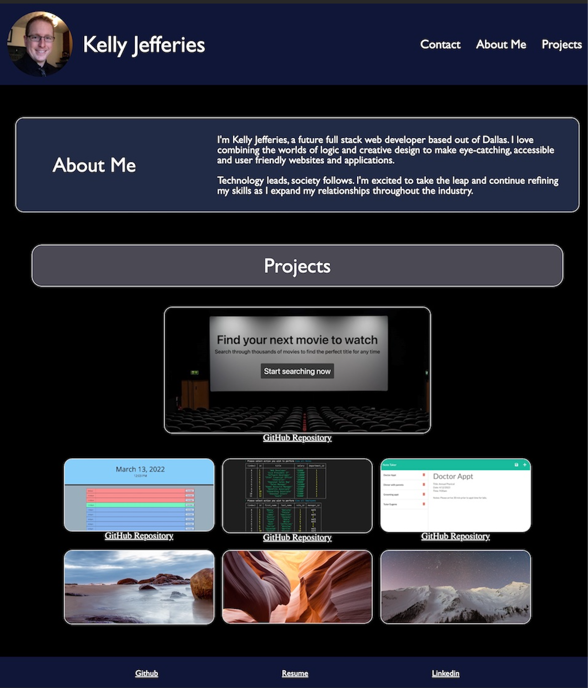

# Portfolio Update v2

## Task:
```

- Updated portfolio with current assignments and removes older material.
- Ensured profile completes all the following objectives:
    * Display Contact Information
    * Links to GitHub and LinkedIn
    * Link to downloadable PDF of current resume
    * Examples of at least 2 pieces of work (projects and/or homework), which include:
        - Project title
        - Link to deployed version
        - Link to GitHub repository
        - Screenshot of deployed application
        - ADDED descriptions for each sample work
    * Mobile-first design/responsive
- Ensured GitHub profile included:
    * Updated pinned repositories and removes older material from pinned.
    * Photo
    * Biography
    * Email address
    * Link to deployed porfolio
    * Have several classmates followed
    * Ensure all Readme files contain:
        - Title of app
        - Live link to deployed app
        - Technologies used
        - Description of the app
        - Screenshots of the app
        - License
        - Contact info for me and collaborators
- Updated Resume with new profect and removed old material
    * Clear, concise, and compelling
    * Includes: Name, Phone, Email
    * Links to GitHub, LinkedIn, and Porfolio
    * Technical skills section with languages known
    * Three of your strongest projects including:
        - Description
        - Languages used
        - Rewrote URL links to display URL, as Career Connection requested
- Ensured LinkedIn profile contained: 
    * Bio statement
    * Professional photo
```
## Portfolio Image:




----

## Links for Github Repository and The Movie Database public page:

- [Github Repository for Portfolio](https://github.com/ksjefferies/professional-portfolio)

- [Portfolio Page](https://ksjefferies.github.io/professional-portfolio/)

## Authors:

- [Kelly Jefferies](https://github.com/ksjefferies)

## Technologies Used:

- HTML
- CSS

## License:

[](http://choosealicense.com/licenses/mit/)